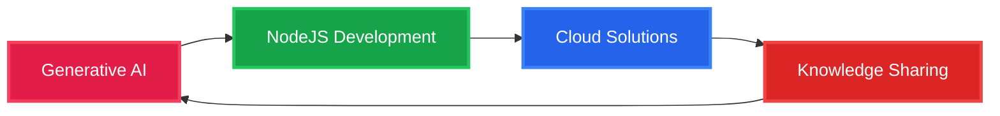

<div align="center">
  
</div>

<div align="center">
  <h2>About Me</h2>
  <p>
    
    
    
  </p>
</div>

<div align="center">
  
</div>


## What Drives Me

```python
class ShishirSrivastav:
    def __init__(self):
        self.role = "Full Stack Developer"
        self.experience = "5+ years"
        self.philosophy = "If it's structured, it Should be Clean"
        self.passion = ["Generative AI", "Clean Code", "Problem Solving", "Knowledge Sharing"]
        self.current_focus = "Growing Continously"
    
    def daily_routine(self):
        return [
            "Chai + Code",
            "Learn something new",
            "Build & Automate",
            "Share knowledge",
        ]
    
    def fun_fact(self):
        return "Only my code has logic, not my conversations 😄."
```

---

## What I Do

<div align="center">
  <table>
    <tr>
      <td align="center" width="33%">
        
        <h3>Development</h3>
        <p>Building Clean Codes and Something New Everytime. Maintainable code following agile methodologies</p>
      </td>
      <td align="center" width="33%">
        
        <h3>AI Innovation</h3>
        <p>Exploring Generative AI capabilities and building intelligent solutions that make a difference.</p>
      </td>
      <td align="center" width="33%">
        
        <h3>Knowledge Sharing</h3>
        <p>Creating educational content on YouTube and Instagram to help others learn Coding and grow up.</p>
      </td>
    </tr>
  </table>
</div>

---

## Tech Arsenal

<div align="center">

### Languages & Frameworks


### AI & ML - Generative AI


### Databases & Storage


### Tools & Technologies


</div>

---

## GitHub Analytics

<div align="center">
  
</div>

---

---

## Connect & Follow My Journey

<div align="center">
  
### Social Media
[](https://www.instagram.com/next_2_beat/)
[](https://discord.gg/XvW8Akkhq8)

### Let's Collaborate
[](mailto:abhiontoppp@gmail.com)

</div>

---

## Content & Learning

<div align="center">
  <table>
    <tr>
      <td align="center">
        
        <br><strong>Discord Server</strong>
        <br>Learn Coding through hands-on Lecture
        <br><a href="#">Watch & Learn</a>
      </td>
      <td align="center">
        
        <br><strong>Instagram</strong>
        <br>Quick bytes of programming knowledge
        <br><a href="#">next_2_beat</a>
      </td>
      <td align="center">
        
        <br><strong>Hosting</strong>
        <br>Host your Small Projects with Me
        <br><a href="#">Read Articles</a>
      </td>
    </tr>
  </table>
</div>

---

## Current Focus



---

## Philosophy

<div align="center">
  <a href="https://github.com/piyushsuthar/github-readme-quotes">
    
  </a>
</div>

> **"If it's structured, it can be automated"** - This drives my approach to solving complex problems through elegant, scalable solutions.

---

<div align="center">
  
  
  ### Ready to build something amazing together?
  
  
  
  **Star my repositories if you find them helpful!**
  
</div>
