<div align="center">
  
</div>

<div align="center">
  <h2>About Me</h2>
  <p>
    
    
    
  </p>
</div>

<div align="center">
  
</div>


## What Drives Me

```python
class ShishirSrivastav:
    def __init__(self):
        self.role = "Full Stack Developer"
        self.experience = "5+ years"
        self.philosophy = "If it's structured, it Should be Clean"
        self.passion = ["Generative AI", "Clean Code", "Problem Solving", "Knowledge Sharing"]
        self.current_focus = "Growing Continously"
    
    def daily_routine(self):
        return [
            "Chai + Code",
            "Learn something new",
            "Build & Automate",
            "Share knowledge",
        ]
    
    def fun_fact(self):
        return "Only my code has logic, not my conversations 😄."
```

---

## What I Do

<div align="center">
  <table>
    <tr>
      <td align="center" width="33%">
        
        <h3>Development</h3>
        <p>Building Clean Codes and Something New Everytime. Maintainable code following agile methodologies</p>
      </td>
      <td align="center" width="33%">
        
        <h3>AI Innovation</h3>
        <p>Exploring Generative AI capabilities and building intelligent solutions that make a difference.</p>
      </td>
      <td align="center" width="33%">
        
        <h3>Knowledge Sharing</h3>
        <p>Creating educational content on YouTube and Instagram to help others learn Coding and grow up.</p>
      </td>
    </tr>
  </table>
</div>

---

## Tech Arsenal

<div align="center">

### Languages & Frameworks


### AI & ML - Generative AI


### Databases & Storage


### Cloud & DevOps


### Tools & Technologies


</div>

---

## GitHub Analytics

<div align="center">
  
  
</div>

<div align="center">
  
</div>

<div align="center">
  
</div>

---

## Achievements & Recognition

<div align="center">
  
</div>

---

## 🌐 Connect & Follow My Journey

<div align="center">
  
### 📱 Social Media
[](https://www.linkedin.com/in/shishir-srivastav/)
[](https://www.instagram.com/programmatic.ly)
[](https://www.youtube.com/channel/UCCZiCzPtg9pmDwChJ4ROIpA)
[](https://shishirslearningjourney.hashnode.dev/)

### 📧 Let's Collaborate
[](mailto:shishir.workemail@gmail.com)

</div>

---

## 📚 Content & Learning

<div align="center">
  <table>
    <tr>
      <td align="center">
        
        <br><strong>YouTube Channel</strong>
        <br>Learn AI with Python through hands-on tutorials
        <br><a href="https://www.youtube.com/channel/UCCZiCzPtg9pmDwChJ4ROIpA">Watch & Learn</a>
      </td>
      <td align="center">
        
        <br><strong>Instagram</strong>
        <br>Quick bytes of programming knowledge
        <br><a href="https://www.instagram.com/programmatic.ly">@programmatic.ly</a>
      </td>
      <td align="center">
        
        <br><strong>Technical Blog</strong>
        <br>In-depth articles on development & AI
        <br><a href="https://shishirslearningjourney.hashnode.dev/">Read Articles</a>
      </td>
    </tr>
  </table>
</div>

---

## 🎯 Current Focus

```mermaid
graph LR
    A[🤖 Generative AI] --> B[🐍 Python Development]
    B --> C[☁️ Cloud Solutions]
    C --> D[📚 Knowledge Sharing]
    D --> A
    
    style A fill:#e11d48,stroke:#f43f5e,stroke-width:3px,color:#ffffff
    style B fill:#16a34a,stroke:#22c55e,stroke-width:3px,color:#ffffff
    style C fill:#2563eb,stroke:#3b82f6,stroke-width:3px,color:#ffffff
    style D fill:#dc2626,stroke:#ef4444,stroke-width:3px,color:#ffffff
```



---

## 💡 Philosophy

<div align="center">
  <a href="https://github.com/piyushsuthar/github-readme-quotes">
    
  </a>
</div>

> **"If it's structured, it can be automated"** - This drives my approach to solving complex problems through elegant, scalable solutions.

---

<div align="center">
  
  
  ### 🚀 Ready to build something amazing together?
  
  
  
  **⭐ Star my repositories if you find them helpful!**
  
</div>
